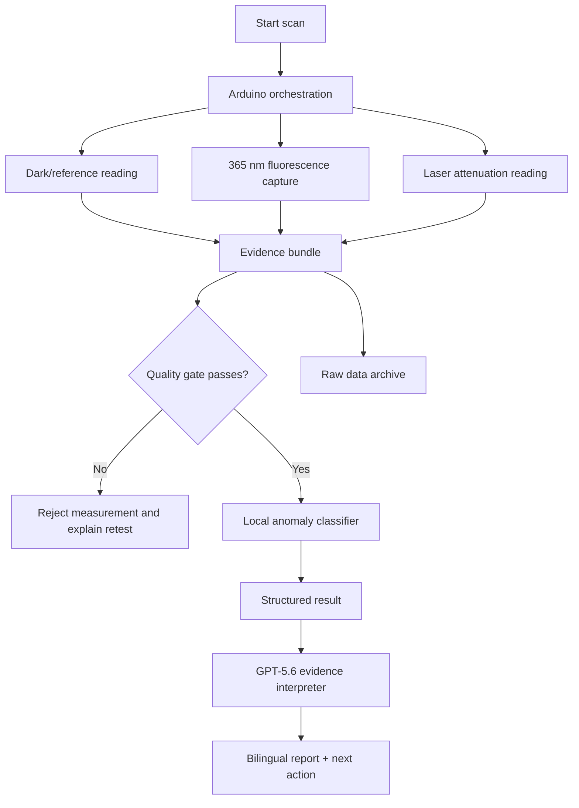

# WaterLAB - Plan maestro para OpenAI Build Week

Fecha de consolidacion: 19 de julio de 2026  
Participante: arkhangio  
Categoria: Apps for Your Life  
Deadline oficial: 21 de julio de 2026, 5:00 p. m. PDT / 7:00 p. m. Lima  
Deadline interno recomendado: 21 de julio, 4:00 p. m. Lima

## 1. Decision estrategica final

### Nombre

**WaterLAB**

### Tagline principal

**AI-guided water screening where laboratories are far away.**

### Frase memorable para el video

> WaterLAB is not a laboratory in a box. It is a smarter way to decide which samples should reach a laboratory first.

### Propuesta en una frase

WaterLAB es un sistema portatil de bajo costo que combina fluorescencia UV-A a 365 nm, atenuacion optica por laser, controles automaticos de calidad e interpretacion bilingue con GPT-5.6 para priorizar muestras de agua sospechosas que requieren repeticion o confirmacion de laboratorio.

### Usuario concreto

- Familias y promotores comunitarios en zonas alejadas de laboratorios.
- Equipos de ciencia ciudadana y educadores ambientales.
- Organizaciones que recolectan muestras cerca de actividad minera.

### Trabajo que resuelve

No reemplaza el laboratorio. Estandariza la captura de evidencia en campo y ayuda a decidir:

1. si la medicion fue tecnicamente valida;
2. si existe una anomalia en los canales demostrados;
3. si conviene repetir la lectura;
4. si la muestra debe priorizarse para un metodo confirmatorio.

## 2. Alcance congelado para el hackathon

### Debe funcionar de extremo a extremo

1. Captura estable con camara USB en Jetson Nano.
2. Control Arduino Uno de iluminacion y lectura del receptor de turbidez.
3. Canal de fluorescencia con LED UV-A de 365 nm.
4. Canal de atenuacion relativa con laser KY-008 y LDR como primera implementacion.
5. Registro sincronizado de imagen, sensor y configuracion.
6. Controles de calidad antes de mostrar un resultado.
7. Clasificacion local de anomalia optica.
8. Explicacion bilingue mediante GPT-5.6.
9. Interfaz completa con modo de repeticion para jueces sin hardware.

### No forma parte del MVP

- Cuantificacion de plomo.
- Afirmar potabilidad o seguridad.
- Resultados en NTU sin calibracion certificada.
- Deteccion directa de metales por UV.
- CNN, YOLO o modelos grandes.
- Microscopio U1600X.
- Camara CSI como camara principal.
- Carrusel sofisticado si compromete la confiabilidad.
- Publicacion cientifica terminada.

### Estado del canal de plomo

Debe aparecer como:

> Reagent-dependent lead cartridge - unavailable and not validated in this prototype.

El contexto de plomo sustenta el problema y la hoja de ruta. No se usa para describir el desempeno actual.

## 3. Arquitectura final



### Reparto de responsabilidades

| Componente | Responsabilidad |
|---|---|
| Arduino Uno | LEDs, servos, laser, LDR/fotodiodo, OLED y protocolo serial |
| Jetson Nano | Camara USB, orquestacion, extraccion de evidencia, inferencia y logger |
| GPT-5.6 | Explicacion de evidencia estructurada y proximo paso |
| Codex | Construccion, depuracion, pruebas, documentacion y trazabilidad del proyecto |
| Alienware | Desarrollo, entrenamiento, pruebas y edicion del demo |
| PC Windows | Despliegue por SSH y control remoto de la Jetson |

### Principio de seguridad

GPT-5.6 nunca recibe autoridad para declarar agua segura, cambiar mediciones o inventar concentraciones. Las restricciones y alertas obligatorias se aplican antes y despues de la llamada al modelo.

## 4. Experiencia de producto

### Estados permitidos

- **Measurement rejected:** la adquisicion fallo y debe repetirse.
- **No optical anomaly detected in demonstrated channels:** no se observo anomalia, pero no implica potabilidad.
- **Optical anomaly detected - retest recommended.**
- **Persistent anomaly - laboratory confirmation recommended.**

Evitar las palabras `clean`, `safe`, `potable`, `lead detected` y `compliant`.

### Pantalla principal

Debe responder en menos de diez segundos visuales a cuatro preguntas:

1. ¿La lectura fue valida?
2. ¿Que canal genero la alerta?
3. ¿Que significa en lenguaje sencillo?
4. ¿Que debe hacer el usuario ahora?

### Muestras seguras para la demostracion

| Muestra | Funcion en el demo | Afirmacion permitida |
|---|---|---|
| Agua | Blanco | Baseline/reference |
| Agua tonica diluida | Fluorescencia | Strong fluorescent proxy |
| Detergente diluido | Abrillantador | Optical-brightener proxy |
| Leche diluida | Atenuacion | Controlled turbidity proxy |
| Mezcla segura | Fusion | Multi-channel anomaly |

Nunca describir estas muestras como aguas residuales, hidrocarburos o plomo reales.

## 5. Contrato minimo de datos

Cada medicion debe tener un `measurement_id` unico compartido por imagen, fila de datos y resultado.

Campos minimos:

```text
measurement_id
timestamp_utc
sample_id
sample_type
run_type
device_id
camera_id
excitation_nm
filter_id
exposure
gain
white_balance_mode
image_path
roi_x
roi_y
roi_width
roi_height
rgb_median_r
rgb_median_g
rgb_median_b
hsv_h
hsv_s
hsv_v
lab_l
lab_a
lab_b
fluorescence_index
turbidity_dark_raw
turbidity_reference_raw
turbidity_sample_raw
attenuation_ratio
quality_flags
local_model_name
local_model_version
local_class
local_confidence
gpt_report_status
operator_notes
```

Estructura recomendada:

```text
data/
  raw/images/
  raw/sensor/
  processed/
  replay_samples/
models/
reports/
```

## 6. Modelo local

### Baseline obligatorio

Un clasificador determinista debe producir un resultado incluso si el modelo entrenado no esta disponible. Ejemplo:

- intensidad fluorescente normalizada;
- razon de atenuacion respecto al blanco;
- umbrales aprendidos exclusivamente de las muestras de demostracion;
- bandera de saturacion, fondo alto o sensor inestable.

### ML opcional pero deseable

Entrenar un modelo clasico pequeno solamente despues de recolectar datos reales suficientes:

- regresion logistica;
- Random Forest;
- SVM/SVR.

Separar entrenamiento y validacion por preparacion de muestra, no por fotografia, para evitar fuga de datos. El modelo solo clasifica las categorias demostradas y no generaliza a contaminantes reales.

## 7. Papel ganador de GPT-5.6

### Entrada

JSON estructurado con:

- resultado local;
- evidencia por canal;
- banderas de calidad;
- alcance del prototipo;
- idioma solicitado.

### Salida

JSON validable con:

```text
summary
evidence
quality_warning
recommended_action
mandatory_disclaimer
language
```

### Restricciones del prompt

- Interpretar solo valores proporcionados.
- No inferir plomo, patogenos, potabilidad ni cumplimiento.
- No inventar concentraciones o unidades.
- Si existen errores de calidad, recomendar repetir antes de interpretar.
- Mantener la explicacion breve, accionable y comprensible.
- Incluir siempre que es una herramienta de screening.

### Por que no es una integracion decorativa

El problema no termina con obtener dos numeros. El usuario necesita comprender evidencia parcial, limitaciones y la siguiente accion. GPT-5.6 convierte un paquete tecnico en comunicacion bilingue consistente, mientras el sistema determinista conserva el control de seguridad.

## 8. Alineacion con los criterios de evaluacion

| Criterio | Evidencia que debe ver el juez |
|---|---|
| Technological Implementation | Flujo fisico funcionando, protocolo serial, logger sincronizado, control de calidad, inferencia local, GPT-5.6 con salida estructurada y trazabilidad de Codex |
| Design | Una experiencia de inicio a resultado, mensajes claros, estados de error, explicacion bilingue y replay sin hardware |
| Potential Impact | Usuario peruano concreto, problema de acceso a laboratorio, priorizacion de muestras y limites honestos |
| Quality of the Idea | Dos modalidades opticas independientes, autorreferencia, fusion de evidencia y comunicacion segura, no otro lector generico de tiras |

El desempate comienza por Technological Implementation. Por eso el video debe mostrar codigo y producto trabajando, no solo la historia social.

## 9. Guion de video - maximo 2:50

### 0:00-0:15 - Hook

Visual: agua aparentemente transparente y mapa/foto propia del contexto peruano.

Narracion:

> When a laboratory is hours away, the first challenge is deciding which samples need it most. WaterLAB turns low-cost optics into structured, explainable screening evidence.

### 0:15-0:35 - Problema y limite honesto

> WaterLAB does not certify water and it does not directly detect lead. It helps communities collect consistent evidence and prioritize suspicious samples for confirmatory analysis.

### 0:35-0:55 - Producto fisico

Mostrar camara USB, Jetson, Arduino, LED UV-A 365 nm, laser y caja oscura.

### 0:55-1:40 - Demo real

1. Insertar blanco.
2. Ejecutar escaneo.
3. Mostrar captura UV y lectura de atenuacion.
4. Escanear muestra fluorescente o turbia.
5. Mostrar evidencia y control de calidad.

Evitar cortes que aparenten una funcionalidad que no existe.

### 1:40-2:10 - GPT-5.6

Mostrar el JSON estructurado, la explicacion bilingue y la recomendacion. Destacar que el modelo explica; no altera la medicion.

### 2:10-2:30 - Codex

Mostrar brevemente sesiones/commits y explicar que Codex construyo el protocolo, logger, orquestacion, pruebas, replay y documentacion durante Build Week.

### 2:30-2:50 - Impacto y cierre

> Not a laboratory in a box. A smarter way to decide what reaches the laboratory first.

## 10. Plan de ejecucion hasta el cierre

### Bloque A - aceptar la fisica

- Validar 20 capturas consecutivas de la camara USB.
- Comparar agua y muestra fluorescente a 365 nm.
- Probar celofan amarillo/naranja y registrar la combinacion elegida.
- Obtener lectura estable de laser + LDR.
- Fijar mecanicamente camara, vaso y receptor.

Condicion de salida: dos senales repetibles y visualmente demostrables.

### Bloque B - cerrar el flujo de datos

- Firmware Arduino minimo.
- Protocolo serial versionado.
- `data_logger` antes que el clasificador.
- Un `measurement_id` para imagen y sensor.
- Lectura de blanco, muestra y banderas de calidad.

Condicion de salida: una ejecucion genera un paquete reproducible completo.

### Bloque C - producto

- Dashboard local ligero.
- Resultado por canal y estado global.
- Manejo de error/reintento.
- GPT-5.6 con salida JSON y validacion.
- Replay mode en Windows/Alienware.

Condicion de salida: un juez comprende y prueba el flujo sin explicacion del autor.

### Bloque D - submission

- README actualizado con realidad final.
- Repositorio con licencia y dependencias.
- Seccion `Built during OpenAI Build Week`.
- Instrucciones de instalacion y replay.
- Video publico en YouTube, con audio, menor de tres minutos.
- Texto e instrucciones en ingles.
- Codex `/feedback` Session ID.
- Borrador Devpost enviado con margen.

## 11. Checklist de elegibilidad

- [ ] Proyecto construido con Codex y GPT-5.6.
- [ ] Cambios posteriores al 13 de julio identificables.
- [ ] Categoria Apps for Your Life seleccionada.
- [ ] Descripcion en ingles.
- [ ] Video publico en YouTube, con audio y menor de tres minutos.
- [ ] El video muestra el producto y el uso de Codex/GPT-5.6.
- [ ] Repositorio accesible para evaluacion.
- [ ] README explica la colaboracion con Codex.
- [ ] `/feedback` Session ID del hilo principal guardado.
- [ ] Replay/test build disponible gratuitamente.
- [ ] Licencias de codigo, hardware y recursos verificadas.
- [ ] Sin musica, logos o recursos de terceros sin permiso.
- [ ] Submission finalizada antes del deadline interno.

## 12. Riesgos y mitigaciones

| Riesgo | Mitigacion inmediata |
|---|---|
| Filtro casero elimina la emision azul | Comparacion A/B antes de cerrar el diseno; seleccionar combinacion empirica |
| LDR lento/no lineal | Usarlo solo como indice relativo; promediar despues de estabilizacion |
| Autoexposicion cambia la senal | Bloquear ajustes si UVC lo permite; registrar exposicion y rechazar saturacion |
| Servo introduce ruido o falla | Fuente separada y modo manual de respaldo |
| No hay suficientes datos para ML | Mantener baseline determinista y no inventar accuracy |
| GPT-5.6 genera una afirmacion insegura | Entrada estructurada, esquema de salida, validacion y disclaimer fijo |
| Juez no tiene hardware | Replay mode con muestras capturadas |
| Historia de plomo supera la evidencia | Plomo declarado como cartucho futuro no validado |
| Jetson falla durante el video | Captura USB estable, ensayo completo y replay en Alienware |

## 13. Condiciones reales para competir por el primer lugar

No existe una estrategia que garantice ganar. Las probabilidades aumentan drasticamente solo si, antes de grabar:

1. una medicion real completa funciona tres veces seguidas;
2. la interfaz rechaza al menos un caso de mala calidad;
3. el resultado conserva los datos crudos;
4. GPT-5.6 explica evidencia real sin exagerarla;
5. el replay funciona en otra computadora;
6. el video demuestra producto, codigo, usuario e impacto dentro de 170 segundos;
7. cada afirmacion corresponde exactamente a algo visible o verificable.

La prioridad ganadora es profundidad de ejecucion, no cantidad de sensores.

## 14. Stack y estructura de implementacion

### Stack minimo compatible con Jetson

- Python 3.8.
- OpenCV y NumPy para captura y evidencia visual.
- pandas para el registro tabular.
- pyserial para Arduino.
- scikit-learn para un modelo clasico opcional.
- Flask para una interfaz local ligera y accesible desde Windows.
- SDK oficial de OpenAI con el modelo `gpt-5.6`.
- Arduino C++ para firmware.

No priorizar XGBoost, TensorRT, CUDA o una CNN antes de cerrar el flujo completo.

### Estructura objetivo del repositorio

```text
WaterLAB/
  README.md
  LICENSE
  .env.example
  requirements-jetson.txt
  requirements-dev.txt
  firmware/
    waterlab_arduino/
  waterlab/
    camera.py
    serial_protocol.py
    orchestrator.py
    quality.py
    features.py
    classifier.py
    data_logger.py
    gpt_interpreter.py
    schemas.py
  app/
    server.py
    templates/
    static/
  data/
    replay_samples/
  models/
  tests/
  docs/
    build-week-evidence.md
    testing-instructions.md
    hardware.md
```

La clave de API se configura por variable de entorno y nunca se guarda en el repositorio. El replay debe poder ejecutar captura ya guardada y clasificacion local; para demostrar el requisito de GPT-5.6 debe existir tambien una ejecucion real y documentada de la integracion.

## 15. Referencias de control

- Reglas oficiales: https://openai.devpost.com/rules
- Guia oficial de GPT-5.6: https://developers.openai.com/api/docs/guides/latest-model
- Contexto de triaje comunitario de plomo en Peru: https://doi.org/10.1029/2025GH001662
- Colorimetria de plomo con AuNP y ML, como precedente futuro: https://doi.org/10.1021/acsomega.0c04255

Estas referencias sustentan el encuadre y la hoja de ruta. No transfieren automaticamente sus limites de deteccion al prototipo WaterLAB.

## 16. Trayectoria de publicacion cientifica

### Veredicto

WaterLAB es potencialmente publicable como hardware cientifico abierto. La novedad defendible es la integracion reproducible de:

- iluminacion multimodal;
- camara y sensor de atenuacion;
- caja oscura impresa en 3D;
- secuenciacion automatica;
- autorreferencia y control de calidad;
- registro sincronizado de datos crudos;
- inferencia local y comunicacion explicable.

El prototipo del hackathon demuestra viabilidad de ingenieria. No constituye todavia la validacion analitica del paper.

### Revista principal

**HardwareX** es el objetivo principal porque publica diseno, construccion y personalizacion de equipos cientificos, incluidos sensores de calidad de agua y alternativas de bajo costo. Exige una aplicacion cientifica demostrada, informacion suficiente para reproducir y validar el dispositivo, y una licencia de hardware abierto.

Titulo provisional:

> WaterLAB: An open-source 3D-printed multimodal optical platform for low-cost water screening and reagent-assisted colorimetry

Alternativas posteriores, si el aporte principal termina siendo el metodo analitico y no el hardware:

- Sensors.
- Water.
- Journal of Fluorescence.

### Separacion obligatoria de fases

#### Fase H - Hackathon

- Probar integracion fisica y software.
- Usar agua, quinina/tonica, abrillantadores y turbidez controlada.
- Reportar indices relativos y clases de demostracion.
- No calcular LOD de plomo.
- No afirmar selectividad frente a contaminantes reales.

#### Fase P1 - Validacion del hardware optico

- Caracterizar estabilidad de LEDs y camara.
- Medir fondo oscuro, saturacion y rango dinamico.
- Evaluar repetibilidad intra-dia e inter-dia.
- Comparar con y sin normalizacion/autorreferencia.
- Evaluar orientacion, volumen, posicion y variacion entre vasos/cubetas.
- Construir al menos una segunda unidad o repetir con otra camara para reproducibilidad.

#### Fase P2 - Cartucho colorimetrico de plomo

- Trabajar con una universidad o laboratorio peruano.
- Seleccionar una quimica compatible y documentada.
- Usar soluciones patron certificadas y controles negativos.
- Definir rango de calibracion antes de entrenar el modelo.
- Estudiar pH, tiempo de reaccion, temperatura e intensidad ionica.
- Medir interferencias de Fe, Zn, Cd, Cu, As y otros iones relevantes.
- Determinar sensibilidad, especificidad, falsos positivos y falsos negativos.
- Calcular LOD/LOQ solo si el modelo de respuesta y los datos lo justifican.

No preparar ni manipular sales de plomo en un entorno domestico.

#### Fase P3 - Muestras reales

- Obtener aprobaciones, trazabilidad y protocolo de muestreo.
- Analizar blancos, muestras adicionadas y agua real.
- Estudiar recuperacion y efectos de matriz.
- Comparar agua mediante AAS, ICP-MS o un metodo de referencia apropiado.
- Reservar XRF para suelo, solidos o aplicaciones especificamente justificadas.

### Paquete minimo reproducible

El repositorio del paper debe publicar una version congelada con DOI que incluya:

- BOM con proveedores, costos y alternativas.
- STL y archivos fuente editables de CAD.
- Planos, cableado y esquematicos.
- Firmware Arduino versionado.
- Software Jetson y entorno reproducible.
- Pesos/modelos y procedimiento de entrenamiento.
- Esquema de datos y dataset crudo permitido.
- Protocolo paso a paso de construccion y operacion.
- Analisis de riesgos, seguridad UV/laser y manejo de muestras.
- Pruebas de validacion y resultados negativos.
- Licencia explicita de hardware abierto y licencia de software.

### Metricas para el paper

No depender solo de R2. Reportar, segun corresponda:

- rango y modelo de calibracion;
- RMSE, MAE y sesgo;
- intervalos de confianza o prediccion;
- repetibilidad y precision intermedia;
- robustez frente a posicion, luz, temperatura y dispositivo;
- recuperacion en muestras adicionadas;
- selectividad e interferencias;
- sensibilidad/especificidad para la decision de triaje;
- tasa de abstencion o mediciones rechazadas;
- comparacion y concordancia con el metodo de referencia.

Los criterios de aceptacion deben fijarse antes del experimento y justificarse por el uso previsto, no elegirse despues de observar los resultados.

### Datos que deben conservarse desde el hackathon

- Todas las imagenes originales, incluso fallidas.
- Lecturas oscuras, referencias y muestras.
- Configuracion de camara e iluminacion.
- Version de firmware, software y modelo.
- Fecha, operador, dispositivo y condiciones.
- Preparacion exacta de cada muestra.
- Motivo de rechazo de cada medicion.

Estos datos permiten que el hackathon sea el estudio piloto del paper, aunque sus muestras seguras no validen contaminantes reales.

### Uso de IA en el manuscrito

El uso de Codex, GPT-5.6 u otras herramientas generativas para preparar el manuscrito debe declararse conforme a la politica editorial vigente. Los autores humanos conservan responsabilidad total sobre referencias, datos, analisis e interpretaciones; una herramienta de IA no puede figurar como autor.

### Condicion de publicabilidad

El dispositivo sera presentable a HardwareX cuando exista simultaneamente:

1. hardware terminado y documentado;
2. aplicacion cientifica demostrada con datos reales;
3. validacion de repetibilidad y robustez;
4. archivos abiertos suficientes para replicar el equipo;
5. afirmaciones limitadas exactamente al rendimiento observado.

La cuantificacion de plomo exigira adicionalmente reactivos validados, patrones certificados, selectividad y comparacion con un metodo de referencia.
