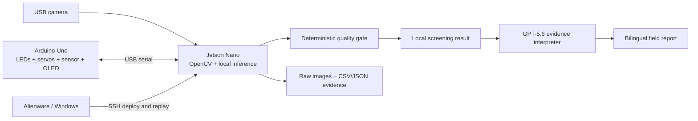

# WaterLAB

**AI-guided multimodal water screening for communities far from a laboratory.**

> WaterLAB is not a laboratory in a box. It is a smarter way to decide which samples should reach a laboratory first.

WaterLAB is a low-cost, portable screening prototype built for the OpenAI Build Week **Apps for Your Life** track. It combines two independently observable optical channels:

- 365 nm UV-A fluorescence imaging for strong fluorescent tracers and organic-anomaly proxies.
- Laser attenuation for relative turbidity screening.

A Jetson Nano captures and processes the evidence at the edge. A deterministic quality layer validates each acquisition before any classification is shown. GPT-5.6 receives only structured measurements and quality flags, then produces a concise bilingual field explanation and next-step recommendation. It never determines whether water is safe or potable.

## The problem

Communities near mining activity may be far from accredited analytical laboratories. Laboratory methods such as ICP-MS and AAS remain essential, but collecting and processing every possible sample is expensive and slow. WaterLAB is designed to help a family, community worker, or citizen-science team collect consistent optical evidence and prioritize suspicious samples for confirmatory analysis.

The initial context is La Oroya and Cerro de Pasco, Peru. The prototype does **not** directly detect dissolved metals. Lead and other heavy metals require a validated reagent cartridge, which is not part of the current demonstration.

## What the Build Week prototype demonstrates

| Capability | Current status |
|---|---|
| Jetson Nano running Ubuntu 18.04 / Python 3.8 | Available |
| Stable 1920 x 1080 USB camera capture with OpenCV | Working |
| Windows-to-Jetson SSH deployment path | Working |
| 365 nm UV-A excitation | Available |
| Laser attenuation hardware | Available; integration pending |
| Arduino-controlled LEDs, servos, OLED, and sensor capture | Integration pending |
| Synchronized image and sensor data logger | Build Week deliverable |
| Local screening dashboard and replay mode | Build Week deliverable |
| GPT-5.6 evidence explanation | Build Week deliverable |
| Lead reagent cartridge | Unavailable and not validated |

## Product flow

1. The operator inserts a sample and starts a scan.
2. WaterLAB records a dark/reference reading.
3. The camera captures the sample under 365 nm excitation.
4. The laser channel records relative optical attenuation.
5. Quality checks reject saturated, unstable, or incomplete acquisitions.
6. The local model reports the observed optical-anomaly class with evidence per channel.
7. GPT-5.6 converts the structured evidence into a bilingual explanation and recommended next step.
8. The raw image, sensor values, configuration, and result are saved under one measurement ID.

## Safety and scientific boundaries

- WaterLAB is a screening prototype, not a regulatory or laboratory instrument.
- "No anomaly detected" does not mean "safe to drink."
- UV fluorescence does not directly detect lead.
- The turbidity channel reports a relative attenuation index, not NTU, until calibrated with certified standards.
- Heavy-metal results require a validated reagent and confirmation by an appropriate reference method.
- The hackathon demonstration uses safe optical proxies such as tonic water, detergent brighteners, and controlled milk dilutions.

## Architecture

## Why GPT-5.6 and Codex matter

GPT-5.6 is the evidence-communication layer. It explains supplied measurements, quality warnings, and limitations in plain English or Spanish. Numeric measurement and safety boundaries remain deterministic.

Codex is being used throughout Build Week to turn the physical prototype into a coherent product: define the serial protocol and measurement schema, implement camera and sensor orchestration, create the replayable judge experience, add tests, document decisions, and prepare the final submission. The repository will preserve dated commits and the primary Codex session ID required by the event.

## Judge-friendly replay mode

Because the physical device uses custom hardware, the repository will include a replay mode with captured sample bundles. Judges can run the same pipeline on a laptop without rebuilding the optical chamber or connecting a Jetson Nano.

Each replay bundle contains:

- Raw image.
- Raw and reference sensor readings.
- Acquisition metadata.
- Expected quality flags.
- Local model output.
- GPT-5.6 input schema and generated explanation.

## Publication roadmap

WaterLAB is also designed as an open scientific-hardware project. The hackathon demonstrates engineering feasibility and a complete screening workflow with safe optical proxies. A future paper will add the analytical validation that the submission intentionally does not claim:

- Open BOM, CAD/STL files, schematics, firmware, software, and raw datasets.
- Optical repeatability, drift, robustness, and inter-day evaluation.
- Calibration and uncertainty for each validated measurement channel.
- Interference and matrix-effect studies.
- A reagent-dependent lead study using certified standards in an institutional laboratory.
- Comparison of water results against AAS, ICP-MS, or another appropriate reference method.

The primary target is a HardwareX hardware article provisionally titled:

> WaterLAB: An open-source 3D-printed multimodal optical platform for low-cost water screening and reagent-assisted colorimetry

The paper will describe only capabilities supported by collected data. Lead will not appear as a validated analyte until the reagent, standards, selectivity, and reference-method comparison have been completed.

## Repository status

This repository began as a research and hardware-design workspace. The working software implementation added during OpenAI Build Week will be identified explicitly in the commit history and submission documentation.

## License

License selection is pending. Before submission, source code and hardware design files will receive compatible explicit licenses, and every third-party dependency and asset will be documented.
