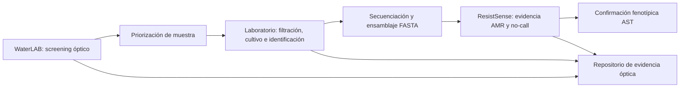

# WaterLAB + ResistSense — Plan científico para una plataforma integrada y un paper publicable

**Estado:** plan de investigación; no constituye validación experimental  
**Fecha:** 20 de julio de 2026  
**Responsable:** Abel Mancilla  
**Horizonte estimado:** 4–8 meses con laboratorio colaborador  

## 1. Visión científica

WaterLAB y ResistSense formarán una plataforma defensiva de vigilancia ambiental
en dos niveles:

1. **WaterLAB** realiza screening óptico, controla la calidad de la adquisición y
   prioriza muestras que requieren análisis de laboratorio.
2. Un **laboratorio colaborador** confirma la presencia de microorganismos,
   obtiene aislamientos y produce secuencias genómicas cuando corresponda.
3. **ResistSense / Genome Firewall** analiza el FASTA ensamblado, separa evidencia
   biológica conocida de asociaciones estadísticas y se abstiene cuando la
   evidencia no es suficiente.
4. Una prueba fenotípica estándar de susceptibilidad antimicrobiana confirma los
   resultados de resistencia.

La plataforma no declara potabilidad, no identifica una bacteria directamente
desde una imagen de agua cruda y no recomienda tratamientos.

### Orden de construcción del programa

**Genome Firewall es la primera fase de desarrollo**, porque el núcleo de
ResistSense ya existe y debe consolidarse antes de conectarlo con datos
ambientales. **WaterLAB es la primera fase del flujo operativo**, porque es el
componente que entra en contacto inicialmente con la muestra de agua.

| Fase de desarrollo | Resultado requerido |
|---|---|
| D1. Consolidar ResistSense | Pipeline FASTA reproducible, validación agrupada, evidencia/no-call, limitaciones y AST obligatorio |
| D2. Validar WaterLAB óptico | Instrumento multiespectral calibrado, dataset independiente y primer paper |
| D3. Añadir microbiología | Filtración/cultivo cromogénico, conteo presumptivo y confirmación en laboratorio |
| D4. Crear el puente genómico | Aislamiento, secuenciación, ensamblaje y cadena de custodia entre muestra y FASTA |
| D5. Validar la plataforma integrada | Casos completos WaterLAB–laboratorio–ResistSense–AST y paper de vigilancia ambiental AMR |

No es necesario esperar a completar toda la plataforma para publicar. El paper
óptico de WaterLAB y la consolidación científica de ResistSense pueden avanzar
como trabajos relacionados antes del estudio integral.



## 2. Tesis del primer paper

### Título provisional recomendado

> **WaterLAB-MSI: An Open-Source Active Multispectral Imaging Platform for
> Low-Cost, Uncertainty-Aware Water Quality Screening**

### Pregunta principal

¿Puede una plataforma abierta y de bajo costo, construida con iluminación en
bandas discretas, una cámara comercial y controles deterministas de calidad,
producir mediciones repetibles de turbidez y fluorescencia de materia orgánica
en matrices de agua no vistas, y abstenerse cuando la adquisición o la muestra
están fuera de calibración?

### Contribuciones defendibles

1. Hardware óptico abierto y reproducible.
2. Adquisición multicanal con geometría e iluminación controladas.
3. Corrección mediante oscuro, blanco y referencia interna.
4. Cuantificación de repetibilidad, deriva, interferencias y variación entre
   dispositivos.
5. Modelo de screening con incertidumbre y `no-call` legible por máquina.
6. Flujo de trazabilidad desde la muestra óptica hasta la confirmación de
   laboratorio.

### Afirmaciones que quedan fuera

- Identificación directa de especies bacterianas en agua cruda.
- Detección directa de plomo u otros metales disueltos sin un ensayo validado.
- Diagnóstico, potabilidad o cumplimiento regulatorio.
- Inferencia de resistencia antimicrobiana desde una fotografía.
- Recomendación, selección o dosificación de antibióticos.

## 3. Nivel de óptica involucrado

La óptica no es un componente secundario: es el núcleo de medición de WaterLAB.
El trabajo debe describirse como **instrumentación óptica aplicada y
multiespectral activa**, no como visión por computadora genérica.

### Escala de madurez óptica

| Nivel | Capacidad | Estado de WaterLAB |
|---|---|---|
| 1. Imagen RGB controlada | Caja oscura, distancia fija, exposición estable y colorimetría relativa | Parcialmente disponible |
| 2. Óptica multimodal | Fluorescencia UV-A, transmisión, atenuación y dispersión | Prototipo actual |
| 3. Multiespectral cuantitativa | 5–8 bandas, filtros, referencias, caracterización del sensor, incertidumbre y calibración contra instrumentos | Objetivo del primer paper |
| 4. Hiperespectral/biofotónica avanzada | Decenas o cientos de bandas contiguas, espectrómetro o microscopía específica | Trabajo futuro; no necesario para el primer paper |

**Nivel confirmado para el paper:** intermedio-alto de óptica aplicada, equivalente
al nivel 3 de esta escala. Incluye física de fluorescencia, transmisión,
dispersión, respuesta espectral, relación señal-ruido, filtros ópticos,
calibración radiométrica relativa y propagación de incertidumbre.

Una cámara iluminada por unos pocos LED produce imágenes **multiespectrales**.
No debe llamarse hiperespectral: la imagen hiperespectral utiliza muchas bandas
estrechas y contiguas.

## 4. Arquitectura óptica objetivo

### Canales candidatos para el estudio piloto

| Canal | Configuración preliminar | Señal que se investiga | Límite interpretativo |
|---|---|---|---|
| Fluorescencia UV-A | Excitación 365 nm + filtro long-pass cercano a 450 nm | Fluorescencia orgánica fuerte, CDOM y trazadores ópticos | Es un proxy, no identifica bacterias ni contaminantes específicos |
| Violeta | LED 405 nm | Respuesta fluorescente complementaria | Debe compararse con 365 nm |
| Azul | LED 450–470 nm | Pigmentos, clorofila y colorimetría | Requiere validación específica |
| Verde | LED cercano a 525 nm | Transmisión, absorbancia relativa y color | Depende de la matriz |
| Rojo | LED 625–660 nm | Atenuación y dispersión | No reportar NTU sin calibración |
| NIR opcional | LED cercano a 850 nm | Dispersión con menor influencia del color | Solo si la cámara conserva sensibilidad NIR |

Las longitudes definitivas se elegirán después de medir el espectro real de los
LED, la transmisión de los filtros y la sensibilidad de la cámara. No se
seleccionarán únicamente por el valor nominal del fabricante.

### Cambios mínimos para alcanzar nivel de paper

1. Caja oscura rígida con geometría repetible.
2. Cubeta o recipiente óptico estandarizado.
3. Exposición, ganancia, foco y balance de blancos bloqueados.
4. Captura oscura y referencia blanca por sesión.
5. Filtro de emisión que bloquee la excitación de 365 nm.
6. Registro de temperatura, LED, cámara, filtro, dispositivo y operador.
7. Medición de estabilidad y calentamiento de cada LED.
8. Sensor de referencia o fotodiodo para normalizar intensidad.
9. Segunda unidad o segunda cámara para evaluar reproducibilidad.
10. Cámara monocromática o sensor espectral de referencia si el presupuesto lo
    permite; no es obligatorio para el piloto.

## 5. Hipótesis y objetivos específicos

### Hipótesis

- **H1:** la combinación de varios canales ópticos mejora la discriminación de
  anomalías frente a una captura RGB de iluminación única.
- **H2:** la normalización oscuro/blanco/referencia reduce la variabilidad entre
  días, operadores y dispositivos.
- **H3:** un control de calidad con abstención reduce el error de las mediciones
  emitidas, a cambio de una cobertura explícita menor.
- **H4:** el desempeño disminuye en matrices no vistas, pero la detección de
  fuera de distribución evita resultados excesivamente confiados.
- **H5 secundaria:** las imágenes temporales de un ensayo cromogénico permiten
  contar colonias presumibles antes o con menor variación que una lectura visual
  manual, sin reemplazar la confirmación microbiológica.

### Objetivo general

Diseñar y validar una plataforma óptica multiespectral abierta para screening de
calidad de agua, con incertidumbre, trazabilidad y un puente verificable hacia
análisis microbiológico y genómico.

### Objetivos específicos

1. Caracterizar la respuesta de cada canal óptico.
2. Establecer un protocolo reproducible de adquisición.
3. Calibrar turbidez y señales fluorescentes contra métodos de referencia.
4. Cuantificar repetibilidad, precisión intermedia y efectos de matriz.
5. Comparar RGB, canal único y fusión multiespectral.
6. Implementar y evaluar reglas de rechazo y `no-call`.
7. Validar externamente con fuentes de agua, días o dispositivos no vistos.
8. Evaluar por separado un módulo bacteriano presumptivo.
9. Definir la interfaz de evidencia entre WaterLAB, laboratorio y ResistSense.

## 6. Diseño experimental del primer paper

### Etapa 0 — Protocolo y prerregistro

**Duración:** 1–2 semanas.

- Congelar pregunta, hipótesis, variables y criterios de exclusión.
- Definir previamente métricas primarias y comparaciones.
- Diseñar hoja de trazabilidad de cada preparación independiente.
- Elegir instrumentos de referencia y laboratorio colaborador.
- Preparar evaluación de riesgos UV, láser y microbiología.
- Prerregistrar el estudio principal después de estimar la varianza en el
  piloto.

**Criterio de salida:** protocolo revisado por una persona con experiencia en
óptica/analítica y otra con experiencia en microbiología del agua.

### Etapa 1 — Caracterización del instrumento

**Duración:** 2–4 semanas.

- Medir estabilidad temporal y calentamiento de LED.
- Medir fondo oscuro, ruido, saturación y rango dinámico.
- Evaluar relación señal-ruido por canal.
- Verificar linealidad relativa con controles ópticos adecuados.
- Cuantificar variación por posición, volumen y orientación de la cubeta.
- Comparar captura normalizada y no normalizada.
- Repetir con al menos dos configuraciones de cámara o dos unidades.

**Criterio de salida:** configuración fija con parámetros versionados y límites
de calidad definidos antes de recolectar el dataset principal.

### Etapa 2 — Piloto analítico

**Duración:** 2–3 semanas.

- Usar aproximadamente 10–20 preparaciones independientes por condición para
  estimar varianza; no confundir fotografías repetidas con réplicas biológicas
  o experimentales.
- Turbidez: emplear estándares trazables y comparar con turbidímetro.
- Fluorescencia: utilizar controles conocidos y, si es posible, comparar con
  fluorímetro, DOC o TOC.
- Incorporar agua destilada, potable y superficial como matrices diferentes.
- Evaluar interferencias de color, turbidez y materia orgánica combinadas.

Las muestras seguras del hackathon —agua tónica, detergente y leche diluida—
solo validan ingeniería. No serán evidencia final de rendimiento ambiental.

**Criterio de salida:** estimación de efecto y varianza suficiente para calcular
el tamaño del estudio principal.

### Etapa 3 — Estudio principal

**Duración:** 4–8 semanas.

- Calcular tamaño muestral mediante análisis de potencia basado en el piloto.
- Recolectar preparaciones en múltiples días y con más de un operador.
- Mantener datos crudos, referencias y fallos de adquisición.
- Congelar el pipeline antes de revelar el test final.
- Separar entrenamiento y prueba por fuente de agua, día y/o dispositivo.
- Reservar una evaluación externa con matrices no utilizadas durante el ajuste.

**Comparadores mínimos:**

1. RGB con luz blanca.
2. Mejor canal óptico individual.
3. Fusión multiespectral.
4. Fusión multiespectral con control de calidad y abstención.

**Criterio de salida:** resultados reproducibles, intervalos de confianza y
análisis completo de errores e interferencias.

## 7. Módulo bacteriano y segundo paper

### Título provisional

> **Low-Cost Multispectral Time-Lapse Imaging of Membrane-Filtered Chromogenic
> Colonies for Presumptive E. coli and Total Coliform Screening**

### Flujo experimental

1. Muestreo y trazabilidad.
2. Filtración por membrana mediante un protocolo reconocido.
3. Medio cromogénico selectivo apropiado.
4. Incubación dentro de un laboratorio autorizado.
5. Captura temporal controlada.
6. Detección, conteo y clasificación presumptiva de colonias.
7. Comparación con lectura experta y método de referencia.
8. Confirmación de un subconjunto mediante identificación microbiológica o
   molecular.

Este módulo no se ejecutará en un entorno doméstico con microorganismos
ambientales desconocidos. Requiere supervisión institucional, bioseguridad,
gestión de residuos y cepas de referencia apropiadas.

### Resultado permitido

- `Presumptive E. coli/coliform signal`.
- Conteo estimado con unidad y protocolo correctamente definidos.
- `No-call` por calidad, interferencia o soporte insuficiente.
- Confirmación de laboratorio obligatoria.

### Resultado prohibido

- Identidad definitiva de especie basada solo en morfología/color.
- Diagnóstico de patógenos.
- Genotipo o resistencia antimicrobiana inferidos desde la colonia fotografiada.

## 8. Puente hacia ResistSense

La integración será de evidencia y trazabilidad, no una conversión directa de
imagen a genoma.

### Contrato de enlace propuesto

```text
waterlab_measurement_id
sample_id
collection_timestamp
collection_location_generalized
optical_device_id
optical_quality_status
optical_anomaly_class
laboratory_sample_id
culture_or_confirmation_method
isolate_id
sequencing_run_id
assembly_accession_or_fasta_hash
resistsense_analysis_id
ast_confirmation_id
chain_of_custody_status
```

No se almacenarán datos personales innecesarios. Las coordenadas sensibles se
generalizarán cuando la publicación o la seguridad comunitaria lo exijan.

### Reglas de integración

1. Una alerta óptica solo prioriza una muestra.
2. ResistSense no se ejecuta sin especie/ensamblaje/calidad compatibles.
3. Un FASTA ausente o no válido produce `no-call`.
4. La ausencia de marcadores AMR nunca prueba susceptibilidad.
5. El resultado genómico requiere AST de laboratorio.
6. Ningún módulo recomienda tratamiento.

## 9. Plan de análisis

### Rendimiento óptico y analítico

- Media, desviación estándar y coeficiente de variación.
- Repetibilidad intradía e precisión intermedia interdía.
- Sesgo, MAE y RMSE frente al método de referencia.
- Intervalos de confianza o predicción.
- Concordancia y gráficos Bland–Altman cuando correspondan.
- Sensibilidad, especificidad y balanced accuracy para clases.
- Matriz de confusión con números absolutos.
- LOD/LOQ únicamente si el diseño, el blanco y el modelo de calibración lo
  justifican.

### Incertidumbre y abstención

- Tasa de `no-call` total y por causa.
- Cobertura frente a riesgo/error.
- Desempeño condicionado a matriz, día, operador y dispositivo.
- Calibración de probabilidades cuando se use un clasificador probabilístico.
- Evaluación fuera de distribución por fuente y dispositivo.

### Prevención de fuga de información

- Fotografías de una misma preparación permanecen en el mismo grupo.
- Preparaciones relacionadas no se dividen entre train y test.
- El test final no se utiliza para elegir bandas, umbrales ni modelos.
- Todo preprocesamiento se ajusta únicamente con entrenamiento.

## 10. Datos y reproducibilidad

### Evidencia que se conservará

- Imagen original y metadatos de cámara.
- Oscuro, blanco y referencia de intensidad.
- Identificador y espectro medido de cada LED/filtro.
- Lecturas auxiliares y temperatura.
- Fuente, preparación, operador, dispositivo y fecha.
- Código, configuración y versión del modelo.
- Razones de exclusión y `no-call`.
- Resultados del método de referencia.
- Historial de transformaciones del dataset.

### Paquete abierto del paper

- BOM con costos y alternativas.
- CAD/STL y archivos fuente editables.
- Esquemáticos y cableado.
- Firmware y software versionados.
- Protocolo de construcción y operación.
- Dataset publicable con diccionario de datos.
- Notebook/script que reproduzca todas las tablas y figuras.
- Model card, datasheet y limitaciones.
- Licencias explícitas de hardware, software y datos.
- Versión congelada con DOI.

## 11. Manuscrito y figuras previstas

### Estructura

1. Introducción y necesidad del screening de bajo costo.
2. Principios ópticos y diseño del sistema.
3. Hardware, firmware y pipeline de adquisición.
4. Protocolo de calibración y control de calidad.
5. Diseño experimental y métodos de referencia.
6. Resultados analíticos.
7. Incertidumbre, abstención e interferencias.
8. Limitaciones y seguridad.
9. Reproducibilidad y costo.
10. Integración futura con microbiología y ResistSense.

### Figuras mínimas

1. Arquitectura óptica y flujo completo.
2. Espectros de LED, filtros y respuesta del sensor.
3. Curvas de calibración y residuos.
4. Repetibilidad entre días y dispositivos.
5. Comparación RGB/canal único/multiespectral.
6. Efectos de matriz e interferencias.
7. Curva riesgo-cobertura del sistema con abstención.
8. Flujo WaterLAB–laboratorio–ResistSense.

## 12. Estrategia editorial

### Primera opción

**HardwareX**, si la contribución principal es el dispositivo abierto,
reproducible y validado.

### Alternativas

- **Sensors**, si predomina la caracterización del sensor y la fusión de
  señales.
- **Journal of Water and Health**, si existe validación microbiológica sólida.
- **Environmental Monitoring and Assessment**, si el foco es monitoreo de
  campo y comparación con métodos de referencia.
- Una revista analítica más exigente solo después de demostrar calibración,
  interferencias, muestras reales y validación externa.

El manuscrito integrado de vigilancia ambiental AMR será posterior a los
papers de validación individuales. No conviene hacer depender el primer paper
de toda la cadena genómica.

## 13. Cronograma de ejecución

| Fase | Duración estimada | Entregable |
|---|---:|---|
| A. Protocolo, revisión y colaboración | 1–2 semanas | Protocolo y roles congelados |
| B. Instrumento óptico nivel 3 | 2–4 semanas | Hardware calibrable y versionado |
| C. Piloto y potencia estadística | 2–3 semanas | Informe piloto y tamaño muestral |
| D. Estudio óptico principal | 4–8 semanas | Dataset congelado y análisis |
| E. Escritura del primer paper | 4–6 semanas | Preprint/manuscrito HardwareX |
| F. Módulo bacteriano | 6–12 semanas adicionales | Dataset de colonias y comparación |
| G. Secuenciación + ResistSense | Depende del laboratorio | Casos trazables integrados |
| H. Paper integrado AMR ambiental | 2–4 meses adicionales | Manuscrito de plataforma completa |

### Ruta realista

- **Paper óptico WaterLAB:** 3–5 meses.
- **Paper con módulo bacteriano:** 5–8 meses.
- **Paper integrado WaterLAB + ResistSense:** 8–12 meses, dependiendo de acceso
  a laboratorio, muestras, secuenciación y confirmación AST.

## 14. Decisiones go/no-go

1. **La cámara no permite bloquear parámetros:** sustituirla o limitar el paper
   a ingeniería cualitativa.
2. **No se consigue un método de referencia:** no afirmar cuantificación;
   reportar únicamente screening relativo.
3. **La señal multiespectral no supera RGB:** publicar el resultado negativo si
   el estudio es sólido o simplificar el instrumento.
4. **La matriz domina la señal:** añadir corrección/interferencia o restringir
   explícitamente el dominio.
5. **No hay laboratorio microbiológico:** separar el módulo bacteriano y no
   cultivar muestras desconocidas por cuenta propia.
6. **No hay secuenciación:** mantener ResistSense como integración futura, no
   simular un enlace imagen–genoma.
7. **El sistema no reconoce una condición:** emitir `no-call`, nunca “agua
   segura”.

## 15. Primeros diez pasos concretos

1. Seleccionar un asesor o colaborador en óptica y uno en microbiología.
2. Inventariar cámara, LED, filtros, cubetas y sensores disponibles.
3. Verificar controles manuales y sensibilidad espectral de la cámara.
4. Diseñar la cámara oscura y fijar la geometría.
5. Construir el protocolo de oscuro/blanco/referencia.
6. Elegir inicialmente tres resultados primarios: turbidez, fluorescencia
   orgánica y calidad/no-call.
7. Conseguir turbidímetro o laboratorio de referencia.
8. Ejecutar el piloto de estabilidad y repetibilidad.
9. Calcular potencia y congelar el estudio principal.
10. Escribir métodos y registrar decisiones antes de entrenar modelos.

## 16. Definición de éxito

El primer paper estará listo para someter cuando:

- el dispositivo se pueda reconstruir con los archivos publicados;
- exista una aplicación científica demostrada con datos independientes;
- la óptica esté caracterizada y calibrada;
- se reporten repetibilidad, interferencias e incertidumbre;
- el test esté separado por muestra/fuente/día/dispositivo;
- cada `no-call` tenga una causa legible;
- las conclusiones coincidan exactamente con los datos;
- el sistema no declare potabilidad, identidad bacteriana definitiva ni
  tratamiento;
- la integración con ResistSense se presente como posterior a secuenciación y
  confirmación, no como inferencia directa desde imágenes.

## 17. Referencias iniciales

1. EPA Method 1103.2, *E. coli in Water by Membrane Filtration*:
   https://www.epa.gov/system/files/documents/2024-06/method-1103.2-10022023_508.pdf
2. Wang et al., detección temprana de bacterias en agua mediante imágenes
   temporales y medio cromogénico:
   https://pmc.ncbi.nlm.nih.gov/articles/PMC7351775/
3. Caracterización de una cámara multiespectral activa de bajo costo:
   https://pmc.ncbi.nlm.nih.gov/articles/PMC11360617/
4. Diferencia entre imágenes multiespectrales e hiperespectrales:
   https://pmc.ncbi.nlm.nih.gov/articles/PMC8473276/
5. Indicadores fluorescentes de *E. coli* y aguas residuales, incluyendo
   corrección por turbidez:
   https://pmc.ncbi.nlm.nih.gov/articles/PMC12070408/
6. Microscopía fluorescente móvil con sondas específicas PNA:
   https://pmc.ncbi.nlm.nih.gov/articles/PMC9088845/
7. Alcance editorial de HardwareX:
   https://www.elsevier.com/researcher/author/tools-and-resources/research-elements-journals
